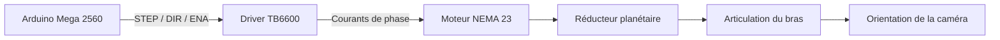

# Dimensionnement et conception d’un actionneur planétaire pour un robot d’inspection TGV

**Noureddine Qarafi · Qassab Abderrahmane · Aymane El Haoudar**  
**ENSAM Meknès · Filière GEE-MCI · Année universitaire 2025/2026**

Projet de conception mécatronique consacré au **dimensionnement d’un actionneur planétaire** destiné aux articulations d’un bras robotisé d’inspection sous caisse de train à grande vitesse.

Le système étudié associe un **moteur pas à pas NEMA 23**, un **réducteur planétaire**, un **driver TB6600** et une **commande Arduino Mega 2560**. Le travail couvre le choix technologique, le dimensionnement mécanique du réducteur, les vérifications de résistance, l’étude de variantes d’intégration et la validation de la chaîne de commande.

## Contexte du projet

Le projet s’inscrit dans le développement du robot **InspecTrain**, destiné à automatiser l’inspection visuelle sous caisse des rames à grande vitesse.

Le robot doit évoluer dans une fosse d’inspection ferroviaire et orienter une caméra vers différentes zones du bogie, des essieux, du système de freinage, des canalisations et des câblages.

Le bras d’inspection comporte **trois degrés de liberté** :

- **Articulation 1 — rotation azimutale** : rotation panoramique du bras.
- **Articulation 2 — coude bas** : élévation du premier segment du bras.
- **Articulation 3 — coude haut** : orientation du segment terminal portant la caméra.

## Objectifs

- Étudier les contraintes mécaniques imposées aux articulations du bras.
- Comparer une motorisation **NEMA 23** à une solution **BLDC**.
- Dimensionner un réducteur planétaire compact.
- Vérifier les conditions géométriques d’assemblage des engrenages.
- Vérifier la résistance des dentures et des arbres.
- Étudier plusieurs variantes d’intégration mécanique.
- Mettre en place une chaîne de commande avec **Arduino Mega 2560 + TB6600 + NEMA 23**.
- Réaliser des essais de rotation et préparer l’évolution vers une commande de position plus avancée.

## Architecture générale



## Choix de la motorisation

Deux technologies ont été étudiées :

| Critère | NEMA 23 | BLDC |
| --- | --- | --- |
| Positionnement | Commande native par pas | Nécessite codeur et boucle fermée |
| Fonctionnement à basse vitesse | Adapté | Plus complexe |
| Couple de maintien | Élevé à l’arrêt | Nécessite une commande active |
| Électronique de commande | Simple | Plus complexe |
| Intégration avec réducteur planétaire | Très adaptée | Possible |
| Rendement à haute vitesse | Modéré | Élevé |

Pour cette application, le **NEMA 23** a été retenu principalement pour sa simplicité de commande, sa précision de positionnement, son comportement à basse vitesse et son intégration compacte avec un réducteur coaxial.

## Dimensionnement du réducteur planétaire

La configuration étudiée utilise :

| Paramètre | Valeur |
| --- | ---: |
| Nombre de dents du soleil `Z1` | 18 |
| Nombre de dents d’un satellite `Z2` | 18 |
| Nombre de dents de la couronne `Z3` | 54 |
| Nombre de satellites | 3 |
| Module | 1 mm |
| Couple moteur utilisé pour le calcul | 1,5 N·m |
| Rendement considéré | ≈ 0,9 |

La couronne est fixe, le soleil constitue l’entrée et le porte-satellites constitue la sortie.

### Rapport de réduction

Le rapport obtenu est :

```text
i = (Z1 + Z3) / Z1
  = (18 + 54) / 18
  = 4
```

La sortie tourne donc **quatre fois moins vite** que l’entrée.

Avec un couple moteur de `1,5 N·m` :

```text
Couple de sortie avec η = 0,9 : 5,4 N·m
Couple de sortie idéal :          6,0 N·m
```

## Vérifications géométriques

Les calculs permettent notamment de vérifier :

- la coaxialité entre soleil, satellites et couronne ;
- la condition d’assemblage des trois satellites ;
- l’absence d’interférence entre satellites ;
- la compatibilité des nombres de dents retenus.

Une attention particulière est portée à l’engrènement intérieur **satellite–couronne**, pour lequel le rapport met en évidence un risque d’interférence nécessitant un ajustement de la géométrie de denture.

## Vérification mécanique

### Dentures

L’effort tangentiel total transmis par le soleil est d’environ :

```text
Ft ≈ 166,7 N
```

Avec trois satellites, l’effort est réparti à environ :

```text
S ≈ 55,6 N par satellite
```

La vérification en flexion donne un module minimal inférieur à `1 mm`. Le **module m = 1 mm** retenu est donc validé pour cette vérification.

### Arbre du soleil — première variante

La première configuration imposait un arbre de diamètre `4 mm`.

La contrainte de torsion calculée est :

```text
τmax ≈ 119,4 MPa
```

Pour une contrainte admissible retenue de `60 MPa`, cette configuration **n’est pas validée** pour l’arbre du soleil.

### Axes des satellites

Pour les axes de satellites de `4 mm`, la contrainte calculée est d’environ :

```text
τmax ≈ 39,8 MPa
```

Le coefficient obtenu est d’environ :

```text
60 / 39,8 ≈ 1,51
```

Cette configuration reste donc acceptable pour les axes des satellites dans les hypothèses du rapport.

## Étude des variantes d’intégration

### Essai 1 — encombrement réduit

- Roulement avec alésage de `4 mm`.
- Arbre du soleil limité à `4 mm`.
- Solution compacte.
- Résistance insuffisante de l’arbre du soleil au couple étudié.

### Essai 2 — encombrement élargi

Le diamètre minimal de l’arbre est recalculé à partir du coefficient de sécurité recherché.

Pour un coefficient de sécurité `s = 3` :

```text
d ≥ 7,26 mm
```

Cette seconde approche libère davantage de place pour l’arbre et les roulements.

Un **carter carré** est également étudié afin de faciliter :

- l’intégration avec la bride du NEMA 23 ;
- la fixation mécanique ;
- l’usinage ou l’impression 3D ;
- l’intégration d’un roulement de diamètre plus important.

## Architecture de commande

La chaîne de commande repose sur trois niveaux :

1. **Arduino Mega 2560** — génération des signaux de commande.
2. **TB6600** — étage de puissance pour le moteur pas à pas.
3. **NEMA 23 + réducteur planétaire** — conversion électromécanique et transmission.

### Signaux utilisés

| Signal | Broche Arduino | Fonction |
| --- | --- | --- |
| STEP / PUL | `D30` | Impulsions de déplacement |
| DIR | `D32` | Sens de rotation |
| ENA | `D33` | Activation du driver |

## Paramètres du test moteur

Avec :

```text
delayTime = 800 µs
```

la fréquence d’impulsion obtenue est d’environ :

```text
fpulse ≈ 625 Hz
```

Pour un moteur de `200 pas/tour` :

```text
Nmoteur ≈ 187,5 tr/min
```

Avec le réducteur `4:1` :

```text
Nsortie ≈ 47 tr/min
```

Le programme de validation effectue des rotations dans les deux sens afin de vérifier le fonctionnement de l’ensemble **Arduino → TB6600 → NEMA 23 → réducteur**.

Le rapport présente également une extension possible vers un **profil de vitesse trapézoïdal** pour assurer une accélération et une décélération progressives.

## Résultats principaux

- Sélection du **NEMA 23** pour les articulations du bras.
- Dimensionnement d’un train planétaire compact.
- Rapport de réduction étudié : **4:1**.
- Couple de sortie estimé : **5,4 à 6,0 N·m**.
- Module d’engrenage `m = 1 mm` validé en flexion.
- Mise en évidence de la faiblesse d’un arbre du soleil de `4 mm`.
- Dimension d’arbre recommandée d’au moins **7,26 mm** pour un coefficient de sécurité de 3 dans les hypothèses étudiées.
- Validation de la commande bidirectionnelle du NEMA 23 avec **Arduino Mega + TB6600**.
- Étude d’une architecture mécanique plus robuste avec carter carré.

## Technologies et outils

`SolidWorks` · `Arduino Mega 2560` · `TB6600` · `NEMA 23` · `Réducteur planétaire` · `CAO mécanique` · `RDM` · `Dimensionnement d’engrenages` · `Mécatronique` · `Robotique`

## Compétences mises en œuvre

- Conception mécanique et mécatronique.
- Dimensionnement de trains planétaires.
- Calcul de rapports de réduction et de couples.
- Vérification mécanique en torsion et en flexion.
- Étude de variantes de conception.
- Intégration moteur–réducteur.
- Commande de moteur pas à pas.
- Programmation Arduino.
- Mise en service et diagnostic d’une chaîne électromécanique.

## Rapport

Le rapport complet contient le contexte du robot d’inspection, la conception du bras, la comparaison **NEMA 23 / BLDC**, les calculs du réducteur, les vérifications mécaniques, les essais d’intégration, l’architecture Arduino/TB6600 ainsi que le protocole de test.

```text
rapport_actionneur_planetaire.pdf
```

## Auteurs

- **Noureddine Qarafi**
- **Qassab Abderrahmane**
- **Aymane El Haoudar**

**Encadrant : Pr. Badr Bououlid Idrissi**  
**École Nationale Supérieure d’Arts et Métiers de Meknès — Université Moulay Ismaïl**
